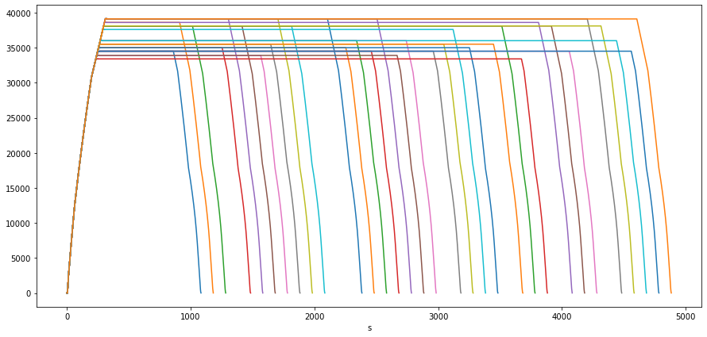
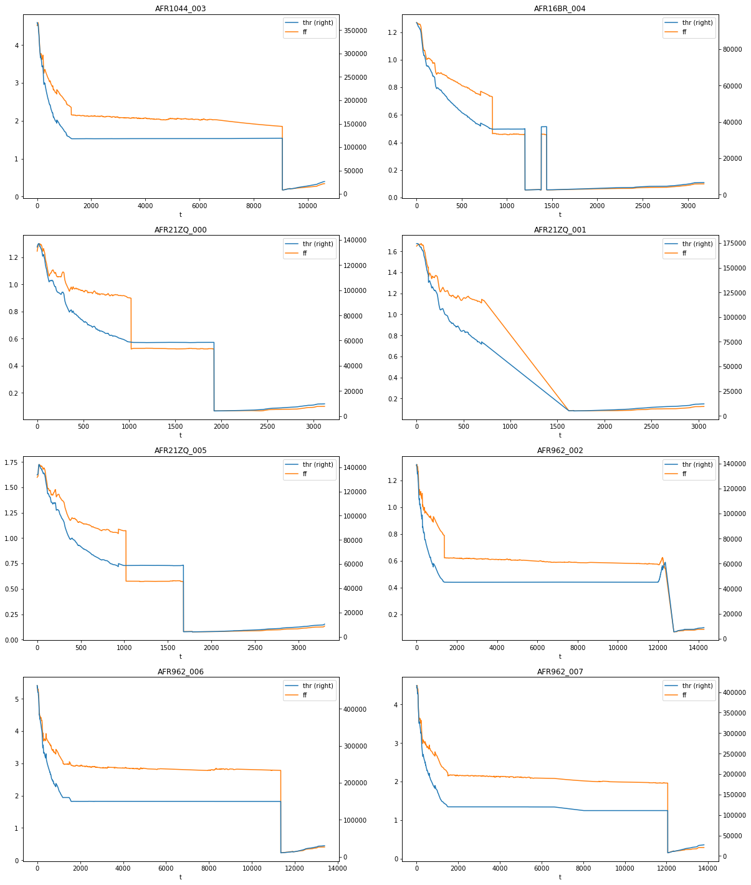

# Fuel Estimation in Air Transportation (FEAT)
This is a fork of the original repository containing Jupyter Notebooks and csv files that support the submitted paper *Fuel Estimation in Air Transportation: Modeling global fuel consumption for commercial aviation*.

In addition, an implementation of the paper algorithms in Python based on the [OpenAP](https://github.com/junzis/openap) and [traffic](https://github.com/xoolive/traffic) libraries is under development. 

## Using FEAT Python Library

Flight profiles can be generated by using the OpenAP [trajectory generation facilities](https://github.com/junzis/openap/blob/master/openap/traj/gen.py). 

```python
import matplotlib.pyplot as plt
from feat import FlightProfileGenerator

fpg = FlightProfileGenerator(ac_type="A320")
flight_profiles = fpg.gen_profiles(step=100)
fp_df = flight_profiles.to_df()

fig, ax = plt.subplots(figsize=(15, 7))
for (_, fp) in fp_df.assign(h=fp_df.h / aero.ft, s=fp_df.s / 1e3).groupby("id"):
    fp.plot(x="s", y="h", ax=ax, legend=False)
```


Once flight profiles are generated, we can estimate thrust, fuel flow and fuel consomption as follows: 

```python
from feat import FlightProfiles, FuelEstimator

fe = FuelEstimator(ac_type=ac_type)
flight_profiles = fe(FlightProfiles.from_df(fp_df))
fp_df = flight_profiles.to_df()
```
```
 	t 	h 	s 	v 	vs 	seg 	fp 	id 	thr 		ff 		fc 		m
0 	0 	0.0 	0.0 	0.0 	0.00 	None 	TO 	5 	0.000000 	0.000000 	0.000000 	61933.456888
1 	30 	0.0 	0.0 	57.9 	0.00 	TO 	TO 	5 	196847.925718 	2.713689 	81.410655 	61852.046233
2 	60 	0.0 	1737.0 	115.8 	0.00 	TO 	TO 	5 	167342.557563 	2.185533 	146.976654 	61786.480234
3 	90 	0.0 	5211.0 	130.8 	12.59 	IC 	CL 	5 	109309.923013 	1.354792 	187.620401 	61745.836487
4 	120 	377.7 	9135.0 	145.8 	12.59 	IC 	CL 	5 	101653.894487 	1.278205 	225.966546 	61707.490342
```
Initial take-off weight mass (TOW) is estimated based on the fuel load calculation procedure described in the FEAT paper (Appendix G for details).


Alternatively, flight profiles can be built from ADS-B trajectories contained in a [Traffic data structure](https://traffic-viz.github.io/traffic.core.traffic.html?highlight=traffic#traffic.core.Traffic) (see [traffic](https://github.com/xoolive/traffic) library).

```python
from traffic.core import Traffic
from feat import FlightProfiles

t = Traffic.from_file("data/adsb_sample.parquet")
fp_df = FlightProfiles.from_traffic(t).to_df()
fp_df.head()
```
```
 	t 	h 		s 		v 		vs 		fp 	id 
0 	0 	381.000 	0.000000e+00 	88.998812 	13.655040 	CLIMB 	AFR1044_003
1 	1 	393.192 	6.150660e+01 	88.998812 	13.720064 	CLIMB 	AFR1044_003
2 	2 	405.384 	1.230133e+02 	88.998812 	13.785088 	CLIMB 	AFR1044_003
3 	3 	417.576 	1.845200e+02 	88.998812 	13.850112 	CLIMB 	AFR1044_003
4 	4 	429.768 	2.460268e+02 	88.998812 	13.915136 	CLIMB 	AFR1044_003
```

```python
from feat import FlightProfiles, FuelEstimator

ac_types = ["A332", "E190", "A20N", "A21N", "A319", "A20N", "B772", "B789", "A359"]
fps = FlightProfiles.from_traffic(t)
cumul = []
for ac_type, fp in zip(ac_types, fps):
    fe = FuelEstimator(ac_type=ac_type)
    cumul.append(fe([fp]).to_df())
flight_profiles = FlightProfiles(cumul, len(cumul))
fp_df = flight_profiles.to_df()

fig, axes = plt.subplots(5, 2, figsize=(15, 25))
for ax, (id, fp) in zip(axes.flat, fp_df.groupby("id")):
    fp.query("ff==ff").plot(
        x="t",
        y=["thr", "ff"],
        secondary_y="thr",
        ax=ax,
        legend=False,
    )
```


## Installation
1) create a conda environment with the traffic library and its dependencies installed in it (see [traffic installation instructions](https://github.com/xoolive/traffic/blob/master/readme.md)).

In the same conda environment:

2) install OpenAP (version with some bug corrections)
```sh
pip install -U git+https://github.com/lbasora/openap.git@bugs
```

3) install FEAT 
```sh
git clone https://github.com/lbasora/feat
cd feat
python setup.py install
```

## Citing FEAT

The algorithms are described in the following paper (see supplementary material [Appendix A to K](https://ars.els-cdn.com/content/image/1-s2.0-S136192092030715X-mmc8.pdf) for algorithm details):

```bibtex
@article{seymour_fuel_2020,
	title = {Fuel {Estimation} in {Air} {Transportation}: {Modeling} global fuel consumption for commercial aviation},
	author = {Seymour, K. and Held, M. and Georges, G. and Boulouchos, K.},
	journal = {Transportation Research Part D: Transport and Environment},
	volume = {88},
	year = {2020},
	pages = {102528},
	issn = {13619209},
	doi = {10.1016/j.trd.2020.102528},
}
```
